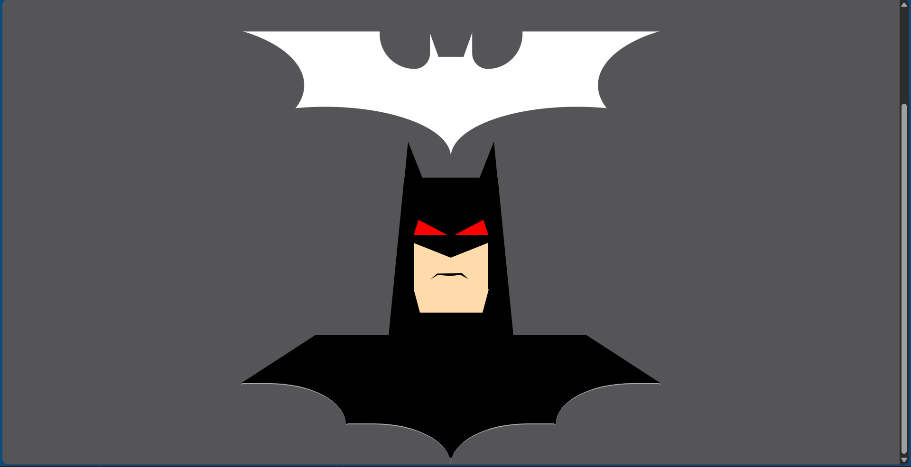
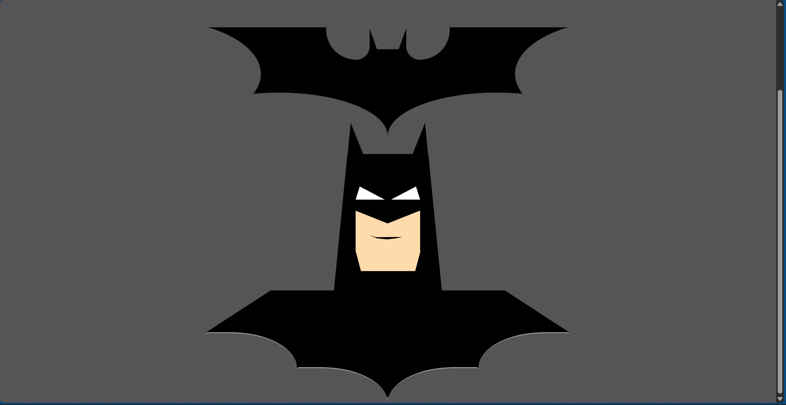

# 🦇 Dark Knight CSS Art

A pure **HTML + CSS** artwork of the **Dark Knight** and the **Bat-Signal**.  
The Bat-Signal glows **white** by default and turns **black** when hovered.  
Batman’s **eyes and lips** also change color on hover, giving it a dramatic effect.  

---

## ✨ Features
- ⚪ **Bat-Signal**: White by default, switches to black on hover.  
- 🦇 **Batman Artwork**: Includes head, eyes, lips, and cape.  
- 👀 **Hover Effects**:
  - Eyes glow **red** on hover.  
  - Lips reshape and turn **red** on hover.  
- 📱 **Responsive Design**:
  - Works on desktop, tablet, and mobile.  
  - Maintains proportions using `aspect-ratio` and media queries.  
- 🎨 Built only with **HTML + CSS** (no images, no JS).  

---

## 📂 Project Structure
```text
dark-knight-css-art/
├── index.html   # Main HTML file
├── batman.css    # CSS styling
└── README.md     # Project documentation
```

---

## 🚀 How to Run
1. **Clone this repository**  
   ```bash
   git clone https://github.com/your-username/dark-knight-css-art.git
   ```
2. **Navigate into the project folder**  
   ```bash
   cd dark-knight-css-art
   ```
3. **Open `index.html` in your browser**

---

## 📸 Preview

### 🖥️ Home Screen  


### 👀 Hover Effect  


---

## 📱 Responsive Design
- **Desktop 🖥️**  
- **Tablet 📱**  
- **Mobile 📲**

---

## 🛠️ Tech Stack
- **HTML5**  
- **CSS3** (Flexbox + Media Queries + Transitions)  

---

## 🌍 Live Demo
👉 [Dark Knight CSS Art](https://akshayjith4.github.io/dark-knight-css-art/)  

---

## 🤝 Contributing
Pull requests are welcome! For major changes, please open an issue first to discuss what you’d like to improve.  

---

## 📜 License
This project is open-source and available under the **MIT License**.  

---

## 💡 Inspiration
Made for fun, tribute to the **Dark Knight**.  
Because… *“I’m Batman.”* 🦇  
